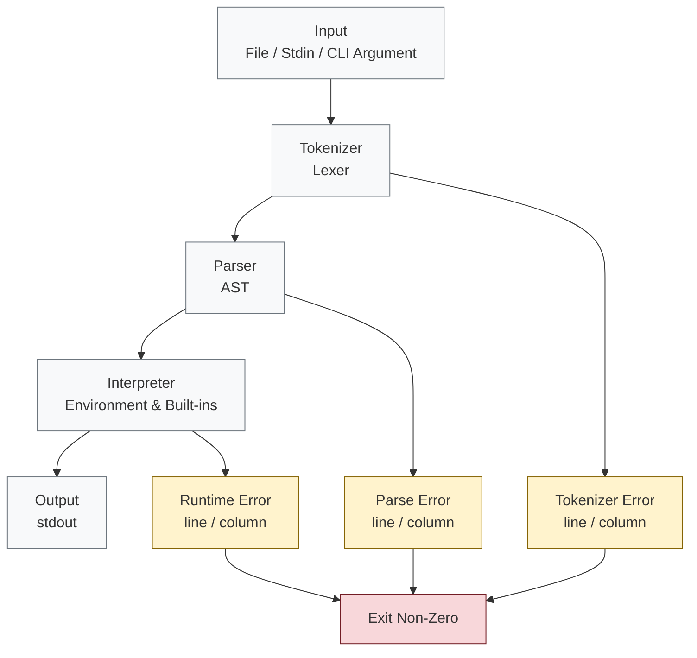

[](#)
[](#)
[](#)
[](#)

---

# JS Runtime in Python

A lightweight JavaScript interpreter written entirely in Python. Execute .js files or inline code from the command line.

---

## Features

- Accepts JavaScript code via file, stdin, or command-line argument
- Supports variables (`let`, `const`), operators, control flow, loops, functions, arrays, strings, and more
- Built-in console, Math, Date, Array, and String methods
- Recursive-descent parser and tree-walking interpreter
- Full scope and environment handling
- Detailed error reporting with line/column information

---

## Workflow



---

## Command-Line Usage

`main.py` reads the JavaScript source from `sys.argv` and supports both file input and piped stdin. The program prints captured console output to stdout and exits with `0` on success or a non-zero status on error.

### From a file

```bash
python main.py sample.js

# For example (windows cmd):
python main.py tests\sample_one.js
```

### From stdin

```bash
echo let x = 5; console.log(x * 2); | python main.py
```

Direct inline argument support is not shown here because the current CLI is documented around file and pipe input modes.

---

## Installation & Setup

1. Clone the repository.
2. Ensure Python 3.10 or later is installed.
3. No dependencies need to be installed because `requirements.txt` is empty.
4. Run the runtime directly:

```bash
python main.py <file>
```

---

## Testing

Tests are located in `tests/test_runtime.py`. To run them:

```bash
python -m pytest tests/
```

Pytest is assumed to be available for test execution, but the runtime itself has no external dependencies.

---

## License

This project is distributed under the MIT License. See [LICENSE.md](LICENSE.md) for the full text.

---

## Author & Contributions

Author: @Kennny7 | Khushal Pareta

Contributions are welcome.
